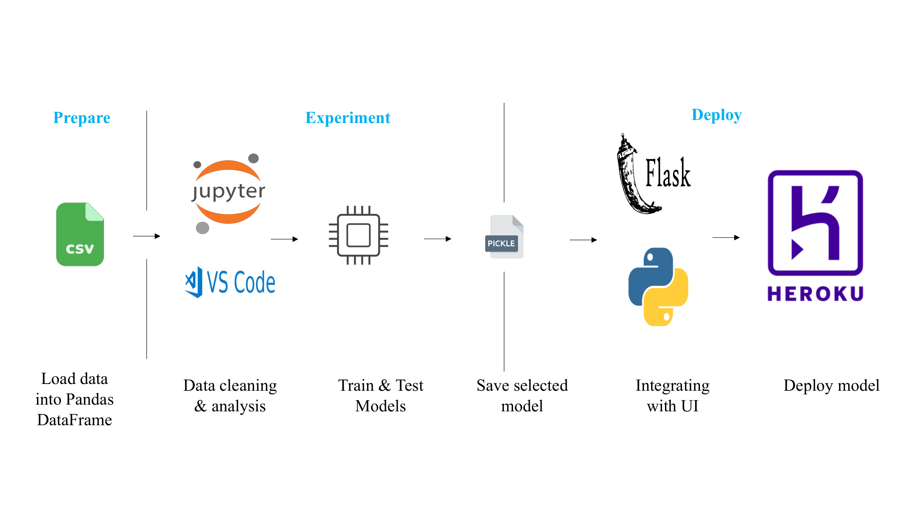
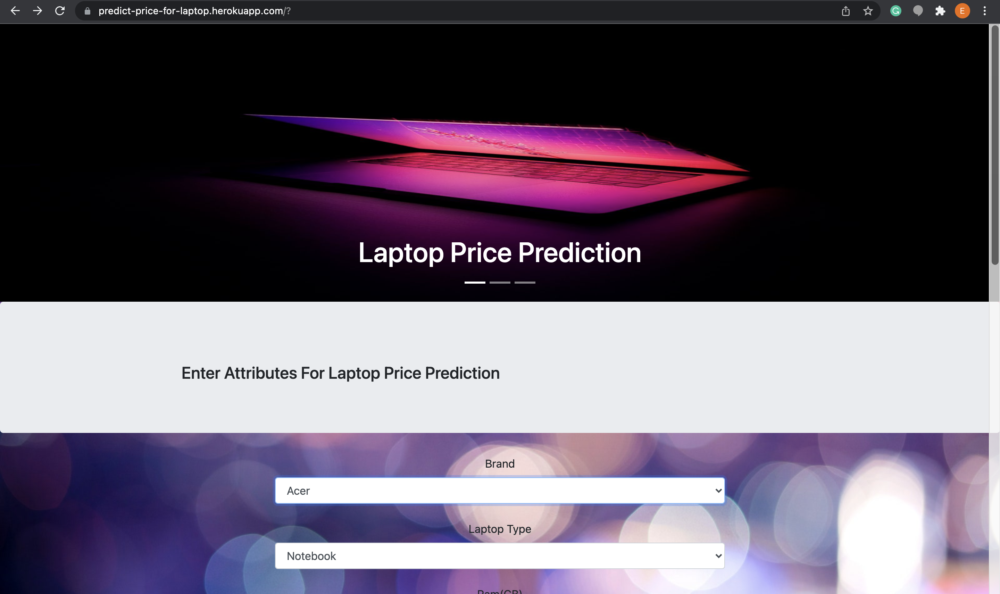

# **Laptop Price Prediction Web Application**

The aim was to train an ML model to predict the price of a laptop based on common attributes like memory, screen resolution, processor etc.

# **Data**

You can download the [laptop price data set](https://www.kaggle.com/muhammetvarl/laptop-price) on Kaggle or from this [repository](https://github.com/FedoAIworld/Laptop-Price-Prediction-Web-App/blob/main/laptop_price.csv)

# **Installation**

To reproduce this project, you can install the [requirements.txt](https://github.com/FedoAIworld/Laptop-Price-Prediction-Web-App/blob/main/requirements.txt) file and follow the notebooks and script.

# **Deployment**

The laptop price prediction web app is deployed on [Heroku](https://predict-price-for-laptop.herokuapp.com/).

